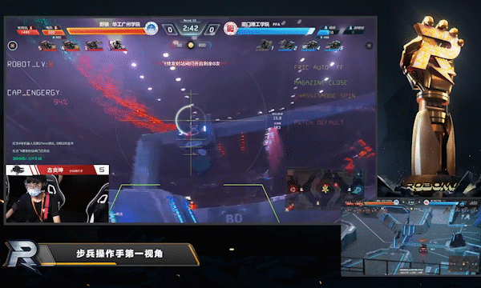
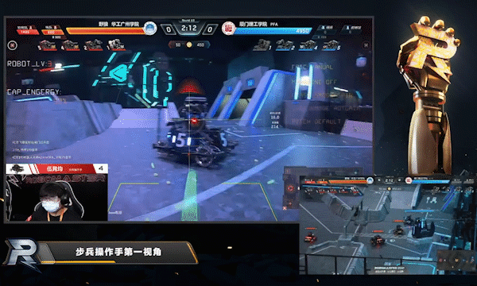
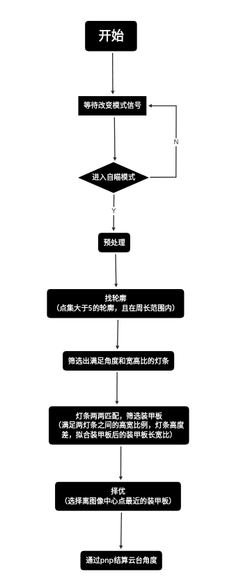
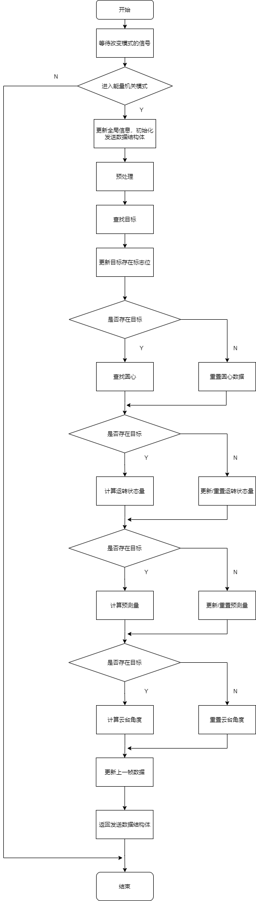
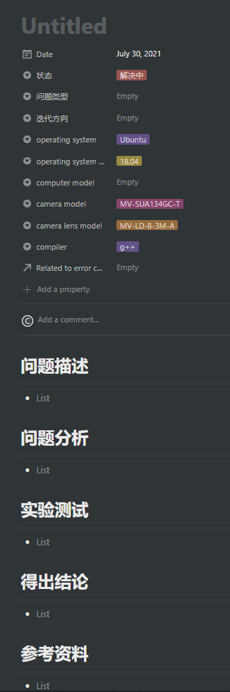

# Robomaster 华广野狼团队视觉2021赛季代码


## 1.功能介绍  

-----

本代码在RoboMaster2021赛季完成了以下内容。
-  1、对敌方装甲板和己方能量机关进行有效识别。
-  2、自定义串口通讯协议与下位机进行通讯控制云台运动。
-  3、对哨兵的运动进行实时分析，实现预测击打。
-  4、根据目标深度和弹丸速度对Pitch轴进行补偿，实现准确命中。
-  5、通过计算能量机关当前的速度对击打位置进行预测，实现大小能量机关的击打。

## 2.效果展示

-----
<center>



</center>

<center>



</center>

### 能量机关
<center>


</center>

<center>


</center>

## 3.依赖工具与软硬件环境  

-----

### 软件运行环境：
| name           | version                        |
|:--------------:|:------------------------------:|
| System         | [`Ubuntu 18.04`](https://discourse.ubuntu.com/t/hirsute-hippo-release-notes/19221) |
| OpenCV         | [`4.4`](https://github.com/opencv/opencv/releases/tag/4.5.2) |
| OpenCV_Contrib | [`4.4`](https://github.com/opencv/opencv_contrib/releases/tag/4.5.2) |
| CMake          | [`3.10.0`](https://cmake.org/) |
| GCC            | [`7.5.0`](https://ftp.gnu.org/gnu/gcc/gcc-11.1.0/) |
| GDB            | [`8.1`](https://www.gnu.org/software/gdb/download/) |
| MindVision-SDK | [`2.1.0`](http://mindvision.com.cn/rjxz/list_12.aspx) |

### 硬件运行环境：

- NUC8i5BEK4

- MindVision MV-SUA134GC-T Industrial Camera

- USB 转 TTL 串口

## 4.编译与安装方式

-----
在开始编码之前，请先完成项目配置:

```shell
sudo bash scripts/autoconfig.sh
```

## 5.文件目录结构及文件用途说明

-----

``` 
├── base                              // 主函数
│   ├── wolfvision.cpp                
│   └── wolfvision.hpp
├── configs
│   ├── angle_solve                   // pnp调试文件
│   │   └── basic_pnp_config.xml      
│   ├── armor                         // 自瞄调试文件
│   │   ├── basic_armor_config.xml    
│   │   └── fan_armor_config.xml
│   ├── buff                          // 能量机关调试文件
│   │   └── basic_buff_config.xml     
│   ├── camera                        // 相机标定文件
│   │   ├── mv_camera_config_1333.xml 
│   │   ├── mv_camera_config_337.xml
│   │   ├── mv_camera_config_359.xml
│   │   ├── mv_camera_config_407.xml
│   │   ├── mv_camera_config_554.xml
│   │   ├── mv_camera_config_555.xml
│   │   └── mv_camera_config_994.xml
│   ├── filter                        // kalman 调试文件
│   │   └── basic_kalman_config.xml
│   ├── ml                            // 数字识别调试文件
│   │   └── onnx_inferring_config.xml
│   ├── roi                           // ROI调试文件
│   │   └── basic_roi_config.xml
│   └── serial                        // 串口调试文件
│       └── uart_serial_config.xml
├── devices                           // 设备
│   ├── camera                        // 相机类
│   │   ├── mv_video_capture.cpp
│   │   └── mv_video_capture.hpp
│   └── serial                        // 串口类
│       ├── uart_serial.cpp
│       └── uart_serial.hpp
├── module                            // 功能
│   ├── angle_solve                   // pnp解算
│   │   ├── abstract_pnp.hpp
│   │   ├── basic_pnp.cpp
│   │   └── basic_pnp.hpp
│   ├── armor                         // 装甲板检测
│   │   ├── basic_armor.cpp
│   │   ├── basic_armor.hpp
│   │   ├── fan_armor.cpp
│   │   └── fan_armor.hpp
│   ├── buff                          // 能量机关检测
│   │   ├── abstract_blade.hpp
│   │   ├── abstract_center_r.hpp
│   │   ├── abstract_object.hpp
│   │   ├── abstract_target.hpp
│   │   ├── basic_buff.cpp
│   │   └── basic_buff.hpp
│   ├── filter                        // 滤波器
│   │   ├── abstract_kalman.hpp
│   │   ├── basic_kalman.cpp
│   │   └── basic_kalman.hpp
│   ├── ml                            // 模型
│   │   ├── mnist-8.onnx
│   │   ├── onnx_inferring.cpp
│   │   └── onnx_inferring.hpp
│   └── roi                           // ROI
│       ├── abstract_roi.hpp
│       ├── basic_roi.cpp
│       └── basic_roi.hpp
├── scripts                           // 脚本
│   ├── autoconfig.sh
│   └── cpplint-pre-commit.sh
└── utils                             // 工具
    └── fps.hpp
```
本赛季的视觉算法程序结构设计是以功能模块化和方便多人协作的思路来进行设计，实现低耦合高内聚设计要求。整体分为4个大的板块：配置参数、硬件驱动、功能实现、工具包。配置参数板块主要包含了各个功能模块所需的参数配置`xml`文件，初始化、条件判断、相机标定参数都储存于此，相较于以前参数位于代码头文件内，减少了因编译所花费的时间，提高了调试效率。硬件驱动板块主要包含了工业相机的驱动程序、串口收发协议等外设驱动，属于驱动层的内容，内容配置完毕后不需再进行重复修改，解耦的同时也减少了重复造轮子的所花费的时间。功能实现板块主要包含了装甲板识别和击打、能量机关识别和击打、弹道补偿算法等各种识别功能和控制算法，内容由多个设计者分别完成并汇总于此，要求模块独立设计，方便后期调试和维护，可以使功能快速实现并测试，进行快速的迭代。工具包板块主要包含了帧率测试包和其他第三方调用工具包等，对整体程序提供相应的测试需要和功能拓展。

## 6.原理介绍与理论支持分析

-----

### 自瞄

<center>



</center>


a. <font color=red>图像二值化的操作</font>：通过`BGR`三通道中红蓝通道相见得到颜色部分的二值图，并与通过灰度值得到的二值图进行求交集从而获得神符的主体部分轮廓，该方法可以大部分滤除掉周围环境光带来的噪声。

b. <font color=red>找轮廓</font>：找出目标轮廓我们主要利用了 `findContours` 函数中的 `contours` 。首先定义了一个容器 `std::vector<std::vector<cv::Point>> contours`循环遍历`contours[i]`筛选出满足周长范围和点集数大于5的点集；

```C++
perimeter = arcLength(contours[i], true);

if (perimeter < light_config_.perimeter_min ||
    perimeter > light_config_.perimeter_max ||
    contours[i].size() < 5) {
    continue;
}
 ```

之后我们将找到的轮廓用旋转矩形标识出来利用的是椭圆拟合矩形函数 `fitEllipse` 。原因是椭圆拟合出来的角度更加准确，且表示的角度范围在 -180°~180° 之间，可以减少额外的转换运算。我们利用椭圆拟合矩形的角度，灯条的角度限定在-30°~30° 之间。

c.<font color=red>拟合装甲板</font>：通过两两灯条匹配，筛选出装甲板并保存到`armor_`中。

``` C++
if (error_angle < 10.f) {
    armor_data_.tan_angle = atan(error_angle) * 180 / CV_PI;
    if (lightJudge(light_left, light_right)) {
        if (averageColor() < 100) {
            armor_.push_back(armor_data_);
        }
    }
}
 ```

d.<font color=red>确定最优装甲板</font>：通过对装甲板到图像中心点的距离进行排序，选择离图像中心点最近的装甲板。
    
``` C++
std::sort(armor_.begin(), armor_.end(),
      [](Armor_Data _a, Armor_Data _b) {
      return _a.distance_center < _b.distance_center;
    });
 ```

e.<font color=red>角度解算</font>：将拟合后的装甲板旋转矩形，装甲板类型，和子弹速度放入`pnp`中进行解算。

``` C++
pnp_.solvePnP(serial_.returnReceiveBulletVelocity(),
              basic_armor_.returnFinalArmorDistinguish(0),
              basic_armor_.returnFinalArmorRotatedRect(0));
 ```

f.<font color=red>哨兵击打模式</font>：这是一个自瞄的附属模式。需要在使用前，跑到环形高地上对准中间的银色矿石再开启该模式。因为哨兵的运动轨迹是完全已知的。
- 1、可以直接计算出哨兵距离枪管的实际距离。
- 2、通过每10ms的陀螺仪角度差计算出当前云台的转动角速度。
- 3、通过延时滤波和陀螺仪的速度判断预测方向。
- 4、通过实际距离算出子弹到装甲板的飞行时间。
- 5、用飞行时间乘以转动角速度可以得到我们要的预测角度。
- 6、通过小孔成像原理将角度转换成像素点个数。
- 7、判断预测方向将6计算出来的结果补到装甲板中心点上。
- 8、最后将补偿后的装甲板旋转矩形放进`pnp`进行计算。

 + 计算哨兵距离枪管的实际距离
``` C++
// initial_gyroscope_ 为初始化时保存的陀螺仪yaw轴位置 即初始位置
// 计算偏差角度

deviation_angle_ = _yaw_angle - initial_gyroscope_;
if (last_deviation_angle_ != 0) {
    deviation_angle_ = (deviation_angle_ + last_deviation_angle_) * 0.5;
}
last_deviation_angle_ = deviation_angle_;

// sentry_dist_ 哨兵到环形高度水平面垂直深度 固定值 3380(mm)
// 计算水平深度
actual_z_ = sentry_dist_ / cos(deviation_angle_ * CV_PI / 180);

// sentry_height_ 哨兵装甲板到枪管高度 即哨兵装甲板在轨道上距离机器人枪管的高度
// 计算实际深度
actual_depth_ = std::sqrt(actual_z_ * actual_z_ + sentry_height_ * sentry_height_);
 ```

 + 判断预测方向
``` C++
// _gyro_speed_data 为下位机发送的陀螺仪速度
// 判断方向
if (_gyro_speed_data > judge_direction_ * 0.01) {
    current_direction_ = 1;
} else if (_gyro_speed_data < -judge_direction_ * 0.01) {
    current_direction_ = -1;
} else {
    current_direction_ = 0;
}
 ```

 + 补偿到装甲板中心点
``` C++
if (filter_direction_ > 0.3) {
    armor_[0].armor_rect.center.x -= abs(forecast_pixels_);
} else if (filter_direction_ < -0.3) {
    armor_[0].armor_rect.center.x += abs(forecast_pixels_);
}
```
 + 将补偿后的装甲板旋转矩形，装甲板类型，和子弹速度放入`pnp`中进行解算。
 

### 能量机关

<center>



</center>

a. <font color=red>图像二值化的操作</font>：通过 BGR 三通道中红蓝通道相见得到颜色部分的二值图，并与通过灰度值得到的二值图进行求交集从而获得神符的主体部分轮廓，该方法可以大部分滤除掉周围环境光带来的噪声，最终通过闭运算的形态学处理将流水灯和装甲板区域大致处理成锤子的形状，方便后续进行轮廓筛选处理。

b. <font color=red>找轮廓</font>：找出目标轮廓我们主要利用了 `findContours` 函数中的 `hierarchy` 。首先定义了一个容器 `vector<Vec4i> hierarchy_` ，每个元素用以储存一个“用四个整形变量表示的轮廓之间的关系” 的向量。`hierarchy_[i][0] ~ hierarchy_[i][3]`,分别表示第 i 个轮廓的后一个轮廓，前一个轮廓，父轮廓，内嵌轮廓的索引编号。若当前轮廓没有对应的后一个轮廓、前一个轮廓、父轮廓、内嵌轮廓的话，则 `hierarchy_[i][0] ~ hierarchy_[i][3]` 的相应位被设置为默认值-1。当我们令外围为顶层，且若外围内的内围轮廓还包含了其他的轮廓信息，则内围内的所有轮廓均归属于顶层。利用这个关系，可以发现，我们的目标是装甲板那个小轮廓，可以把没有父轮廓（ `hierarchy_[i][3]<0`）的跳过。然后再基于已建立的父子轮廓的关系，我们可以根据他们的面积比和周长比进行一次粗略的筛选，并将找到的轮廓用旋转矩形标识出来，将大小轮廓相关的数据分别保存至 `abstract_blade::FanBlade` 和 `fan_armor::Detector`所创建的对象 `big_target_` 和 `small_target_` 中，最后将其按照父子轮廓为一组放入`bstract_target::Target` 类所创建的对象 `candidated_target_` 里面，以方便后续调用数据。

```C++
    // 用于寻找小轮廓，没有父轮廓的跳过，以及不满足6点拟合椭圆
    if (hierarchy_[i][3] < 0 || contours_[i].size() < 6 || contours_[static_cast<uint>(hierarchy_[i][3])].size() < 6) {
      continue;
    }

    // 小轮廓周长条件
    small_rect_length_ = cv::arcLength(contours_[i], true);
    if (small_rect_length_ < buff_config_.param.SMALL_TARGET_Length_MIN) {
      continue;
    }

    // 小轮廓面积条件
    small_rect_area_ = cv::contourArea(contours_[i]);
    if (small_rect_area_ < buff_config_.param.SMALL_TARGET_AREA_MIN || small_rect_area_ > buff_config_.param.SMALL_TARGET_AREA_MAX) {
      continue;
    }

    // 大轮廓面积条件
    big_rect_area_ = cv::contourArea(contours_[static_cast<uint>(hierarchy_[i][3])]);
    if (big_rect_area_ < buff_config_.param.BIG_TARGET_AREA_MIN || big_rect_area_ > buff_config_.param.BIG_TARGET_AREA_MAX) {
      continue;
    }
```

之后我们将找到的轮廓用旋转矩形标识出来利用的是椭圆拟合矩形函数 `fitEllipse` 。原因是椭圆拟合出来的角度更加准确，且表示的角度范围在 0°~360° 之间，可以减少额外的转换运算。我们利用椭圆拟合矩形的角度，把筛选条件限定在装甲板和扇叶拟合出来的矩形的角度差值在 80-110 之间。

```C++
    // 组合判断角度差
    if (candidated_target_.diffAngle() >= buff_config_.param.DIFF_ANGLE_MAX || candidated_target_.diffAngle() <= buff_config_.param.DIFF_ANGLE_MIN) {
      continue;
    }

    // 判断内轮廓的长宽比是否正常
    if (candidated_target_.Armor().aspectRatio() >= buff_config_.param.SMALL_TARGET_ASPECT_RATIO_MAX || candidated_target_.Armor().aspectRatio() <= buff_config_.param.SMALL_TARGET_ASPECT_RATIO_MIN) {
      continue;
    }

    // 判断内外轮廓的面积比是否正常
    if (candidated_target_.areaRatio() <= buff_config_.param.AREA_RATIO_MIN || candidated_target_.areaRatio() >= buff_config_.param.AREA_RATIO_MAX) {
      continue;
    }
```

c.<font color=red>确定旋转矩形四点顺序</font>：根据大小扇叶的比值关系来进行筛选得到可以用于判断扇叶状态的目标后，对旋转矩形的四个顶点进行排序处理：令半径较大的两个点分别为 0 和 1，令半径较小的两个点为 2 和 3，并以顺时针的方向依次排序，如图所示


最终的排序方式如上如圆圈中所示，这里的排序方法利用的是 `RotateRect` 类里面的特性，`RotateRect` 类所标识的矩形顶点编号如上图所示，y 值最大的为 0 点，其余按照顺时针一次编号，若出现两个相同的 y 值，则计 x 值最小的为 0 点。我们利用这样的特性，我们只要判断装甲板的两条长边的中心点跟 `big_target_` 中心点的距离近，就可以顺利得到装甲板四点的正确的顺序。

d.<font color=red>判断旋转矩形状态</font>：通过两旁的灯杆。利用装甲板两条宽边向圆心方向延一段比例的距离，建立两个小块 roi 区域，计算 roi 区域的平均值，若 roi 区域内的值满足一定条件，则表明目标矩形是激活的（装甲板旁边有两个杆）否则未激活。

e.<font color=red>找出中心 R </font>：根据大扇叶的中点并往圆形衍生一定量的距离之后，用 ROI
进行框选，并对 ROI 范围内的目标进行筛选，最终稿得到中心 R，并根据中心 R 做出目标的轨迹圆。

f.<font color=red>隔帧判断扇叶旋转方向</font>：判断顺时针还是逆时针的方法是根据历史角度和当前角度的差值（要滤波）来判断.由于程序运行速度快，帧率高，未防止采样频率过高从而导致放大了低频噪声，我们的处理方式是隔帧进行采样，降低采样频率，去掉较大和较小的插值，再利用一阶延迟滤波器进行判断 `d_angle_ = (1 - r) * d_angle_ + r * diff_angle_;`。且由于大符的变速运动在最低速的过程中容易被误判为停止不转或是反方向转动，从而导致转动状态一直在停止和转动之间来回切换，所以后期是直接抛弃了停止转动这个标志位，并对数据进一步处理，从而得到稳定的转向状态量。一阶滤波器的使用需要注意的是：滤波系数越小，滤波结果越平稳，但是灵敏度越低；滤波系数越大，灵敏度越高，但是滤波结果越不稳定。

g. <font color=red>建立打击模型，实时计算预测量</font>：由于扇叶上的装甲板目标相对于能量机关激活点是在一定范围内进行规律运动，那么我们可以根据目标相对于机器人的枪管建立一个打击模型，并根据这个模型来进行目标的预测计算。预测的原理是根据当前目标的位置、运转速度和子弹弹速来计算子弹到达目标的飞行时间，并根据这个飞行时间来计算预测量，用卡尔曼滤波器对预测量进行处理过后，加入到以大符圆心建立的极坐标系上，得到目标击打点的位置信息，最终转换成图像的笛卡尔坐标系。

h. <font color=red>解算云台角度</font>：有两种方案可以使用，一种是 PnP 算法，一种是小孔成像原理。由于两种效果差不多，但在比赛过程中发现 PnP 算法出现暂未解决的抖动，所以在比赛中使用的是自行计算重力补偿的小孔成像方案。PnP 方案是利用装甲板目标的四个顶点、其实际大小和相机畸变参数来计算目标相对于相机的位姿信息，我们根据这些位姿信息进行坐标系的转换（相机 -> 云台，云台坐标系和枪管坐标系重合），最终得到目标相对于枪管的位姿信息，并通过解算，得到云台需要转动的 Yaw 轴角度和 Pitch 轴角度；小孔成像方案是根据相机焦距、相机像素大小、目标图像长宽、目标深度信息和目标实际大小得到目标相对于相机坐标系中心的偏移量，并将坐标系映射到云台坐标系下，解算得出云台需要转动的 Yaw 轴角度和 Pitch 轴角度。调试过程中发现，子弹弹道并不一定是图像的正中心，所以需要根据实车进行相应的调整，修改子弹弹道的中心散布点。


## 7.MiniPC 与单片机的通信方式说明

------

接收下位机数据
| 头帧| 数据 1| 数据 2| 数据 3|数据 4|数据 5|数据 6|数据 7|数据 8|数据 9|数据 10|数据 11|数据 12|数据 13|数据 14| 尾帧|
| ----| -----| ----| ----| ----|----|----|----|----|----|----|----|----|----|----|----|
|0x53|颜色|模式|机器人 ID|yaw轴陀螺仪数据|yaw轴陀螺仪数据|yaw轴陀螺仪数据|yaw轴陀螺仪数据|pitch轴陀螺仪数据|pitch轴陀螺仪数据|pitch轴陀螺仪数据|pitch轴陀螺仪数据|陀螺仪加速度高八位|陀螺仪加速度低八位|当前子弹速度|0x45|

```text
数据1：颜色 0为己方红色 1为己方蓝色 2为己方红蓝双色（调试模式）
数据2：模式 0为自瞄 1为小能量机关 2为大能量机关 3为打击哨兵模式 4为小陀螺模式 5为录像模式 6为无人机模式 7为哨兵模式 8为雷达模式 其余情况默认为自瞄模式
数据3：当前机器人ID 0为英雄 1为工程 2为步兵 3为无人机 4为哨兵
数据4~7：yaw轴的陀螺仪数据（联合体）
数据8~11：pitch的陀螺仪数据（联合体）
数据12~13：陀螺仪的加速度
数据14：当前子弹速度m/s 8 10 16 15 18 30
```

发送至下位机数据
|头帧|数据 1|数据 2|数据 3|数据 4|数据 5|数据 6|数据 7|数据 8|数据 9|数据 10|数据 11|尾帧|
|----|----|----|----|----|----|----|----|----|----|----|----|----|
|0x53|识别标志|射击信息|yaw 轴正负号|yaw 轴低八位|yaw 轴高八位|pitch 轴正负号|pitch 低八位|pitch 高八位|深度低八位|深度高八位|CRC 校验位|0x45|

```text
数据1：是否识别到目标的标志 0为无目标 1为有目标
数据2：是否射击的信号 0为停止射击 1为允许射击
数据3：yaw 轴的正负号 0为负号 1为正号
数据4|5：yaw 轴角度
数据6：pitch 轴的正负号 0为负号 1为正号
数据7|8：pitch 轴角度
数据9|10：深度信息
数据11：CRC校验位
```


## 8.代码设计

-----

### 自瞄
 - 设计的初衷
打击装甲板作为步兵的功能模块之一，设计时以便于调试、可读性高和实时性作为主要要求。既能迅速适应场上各种因素，也方便后人进一步优化修改。

```C++
runImage(_src_img, _receive_data.my_color);
draw_img_ = _src_img.clone();

if (findLight()) {
if (fittingArmor()) {
    finalArmor();
    lost_cnt_ = 10;
    if (armor_config_.armor_draw == 1 ||
        light_config_.light_draw == 1 ||
        armor_config_.armor_edit == 1 ||
        light_config_.light_edit == 1) {
    cv::imshow("[basic_armor] getWriteData() -> draw_img_", draw_img_);

    draw_img_ = cv::Mat::zeros(_src_img.size(), CV_8UC3);
    }

    return true;
    }
}
if (armor_config_.armor_draw == 1 ||
    light_config_.light_draw == 1 ||
    armor_config_.armor_edit == 1 ||
    light_config_.light_edit == 1) {
    cv::imshow("[basic_armor] getWriteData() -> draw_img_", draw_img_);

    draw_img_ = cv::Mat::zeros(_src_img.size(), CV_8UC3);
}

return false;
```
且各个模块之间通过公共的数据结构进行信息交互，所以在出现问题时只需要定位到相应的模块，对其里面的内容进行修改即可，不会影响到其他模块的内容。并且，我们在各个模块的判断处都设置了相应的状态提示信息于终端进行显示，可以根据终端输出的信息判断问题出现的位置，快速排查问题。

### 能量机关
- 设计的初衷

打击能量机关作为步兵的功能模块之一，设计时以耦合度低、维护性高、方便快速调试和可读性高作为主要要求，既能迅速适应场上各种因素，也方便后人进一步优化修改，所以能量机关模块从整体上来看是类似于 OpenCV 对图像处理的思路，需要什么功能就执行什么函数，将图像中的信息一步一步的分离出来，得到我们自己想要的信息，而每一个功能模块都封装成一个函数，只需要输入相应的参数即可得到相应的返回值，整个流程就像流水线一般进行工作，使得整体处理顺序清晰，并且会根据标志位 `is_find_target_` 选择跳过部分功能函数，减少计算量。

```C++
uart::Write_Data Detector::runTask(cv::Mat& _input_img, const uart::Receive_Data& _receive_info) {
  uart::Write_Data send_info;

  /* 获取基本信息 */
  getInput(_input_img, _receive_info.my_color);

  /* 预处理 */
  imageProcessing(src_img_, bin_img_, my_color_, static_cast<Processing_Moudle>(buff_config_.ctrl.PROCESSING_MODE));

  /* 查找目标 */
  findTarget(dst_img_, bin_img_, target_box_);

  /* 判断目标是否为空 */
  is_find_target_ = isFindTarget(dst_img_, target_box_);

  /* 查找圆心 */
  final_center_r_ = findCircleR(src_img_, bin_img_, dst_img_, is_find_target_);

  /* 计算运转状态值：速度、方向、角度 */
  judgeCondition(is_find_target_);

  /* 计算预测量 单位为弧度 */
  final_forecast_quantity_ = doPredict(static_cast<float>(_receive_info.bullet_velocity), is_find_target_);

  /* 计算获取最终目标（矩形、顶点） */
  calculateTargetPointSet(final_forecast_quantity_, final_center_r_, target_2d_point_, dst_img_, is_find_target_);

  /* 计算云台角度 */
  if (is_find_target_) {
    buff_pnp_.solvePnP(28, 2, target_2d_point_, final_target_z_);

    send_info.yaw_angle   = angleCalculation(pre_center_, 0.0048, src_img_.size(), 8).x;
    send_info.pitch_angle = angleCalculation(pre_center_, 0.0048, src_img_.size(), 8).y;

    send_info.depth       = final_target_z_;
    send_info.data_type   = is_find_target_;

    fmt::print("[{}] Info, yaw: {}, pitch: {}, depth: {}\n", idntifier_yellow, send_info.yaw_angle, send_info.pitch_angle, send_info.depth);
  } else {
    send_info             = uart::Write_Data();
  }

#ifndef RELEASE
  displayDst();
#endif

  /* 更新上一帧数据 */
  updateLastData(is_find_target_);

  return send_info;
}
```

各个模块之间通过公共的数据结构进行信息交互，所以在出现问题时只需要定位到相应的模块，对其里面的内容进行修改即可，不会影响到其他模块的内容。并且，我们在各个模块的判断处都设置了相应的状态提示信息于终端进行显示，可以根据终端输出的信息判断问题出现的位置，快速排查问题。

## 9.测试方案



我们的测试方式是通过测试记录表的内容进行逐项排查测试，如上图所示，标题会填写本次的测试内容，下列各个选项中填写本次测试所处的环境变量和相关信息。填写完相关信息后将本次测试内容进行详细描述，并记录于问题描述下方，接着在问题分析部分填写测试中可能出现的问题以及列举出现问题的可能原因，在实验测试部分填写需要测试的项目，建立相应的表格，记录测试数据，最终在得出结论板块说明本次的测试成功，并记录相应的参考资料至参考资料板块。

## 10.所发现的问题

- `vector` 容器的优化使用，需要对其进行适当的释放，调试过程中发现如果对 `vector` 容器多次的创建，会导致容器在创建时占用多余的空间，从而导致内存溢出，解决方法为对 `vector` 进行单次创建，使用时只需要将数据擦除再重新存入即可。
- PnP算法在计算目标接近中心时的目标位姿会出现异常的位姿判断，导 致目标位姿信息出现抖动，影响云台的控制，目前尚未清楚具体原因。如果想继续使用 PnP 的方案来解算云台角度，则需要将目标矩形的4个顶点进行反序放置，可以有效抑制抖动，但不清楚具体原理。
- 调试时发现pitch轴的云台会出现变软现象，排查发现有两个原因导致：
  1. pitch的控制电控方面使用的是电机环，需改为陀螺仪环
  2. 视觉发送数据的帧率不能过低，过低会导致云台响应缓慢
- 小孔成像方案计算目标偏转角度时需要注意的是，相机焦距和单个感光元件的大小单位要使用正确，否则计算会出错。
- 当相机掉线的情况出现时，需要对其使用的内存完全清空，才可以进行下一次实例化，否则会出现内存溢出，导致程序异常退出。
- 串口发送的速率不要一味的追求过高，过高的串口速率，传递信号中的错误信号也会被放大，导致代码云台的不稳定。


## 11.未来优化方向

-----

### 自瞄
- 继续研究反小陀螺算法，提高反小陀螺算法的自适应程度，提高自动化程度，提高反小陀螺算法击打命中率。
- 在装甲板识别中加入数字识别，提高识别准确率。
- 处理好哨兵模式的反复变向。
### 能量机关
- 添加程序重置函数，防止程序出现异常。
- 预测量的计算需要进行插值补偿，防止空帧所造成的影响。
- 解决 PnP 计算出错的问题。
- 添加自动控制部分，减少操作手在目标丢失时需要手动对准的操作。

